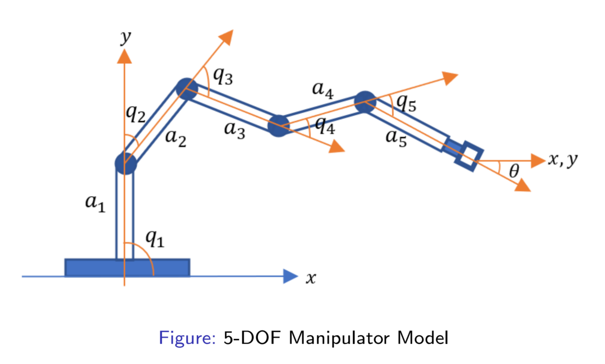
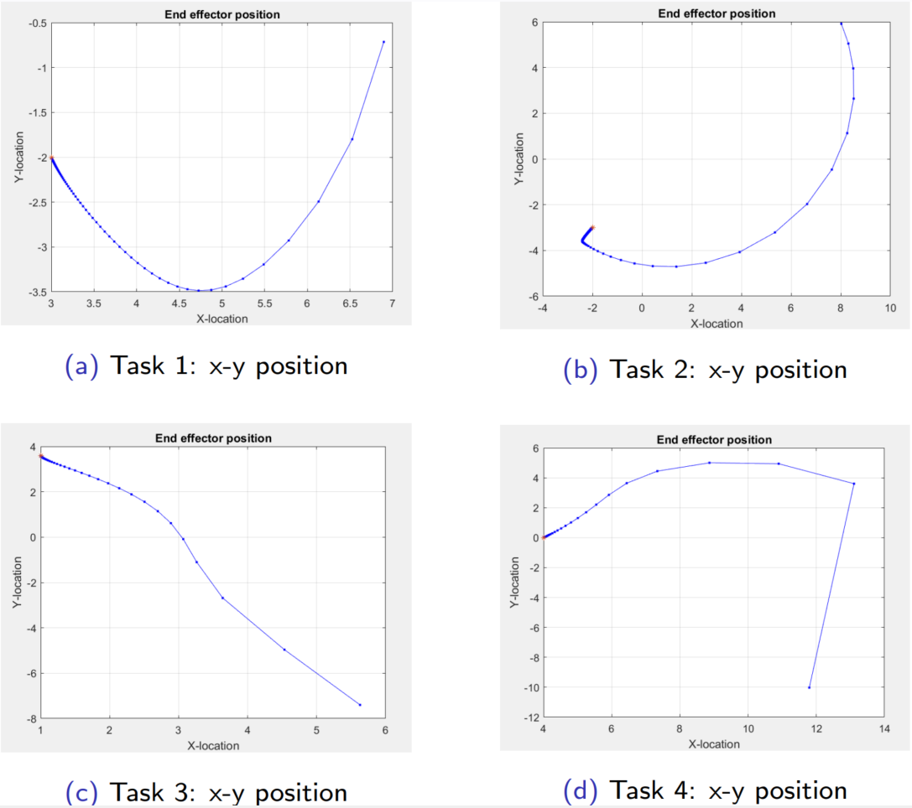
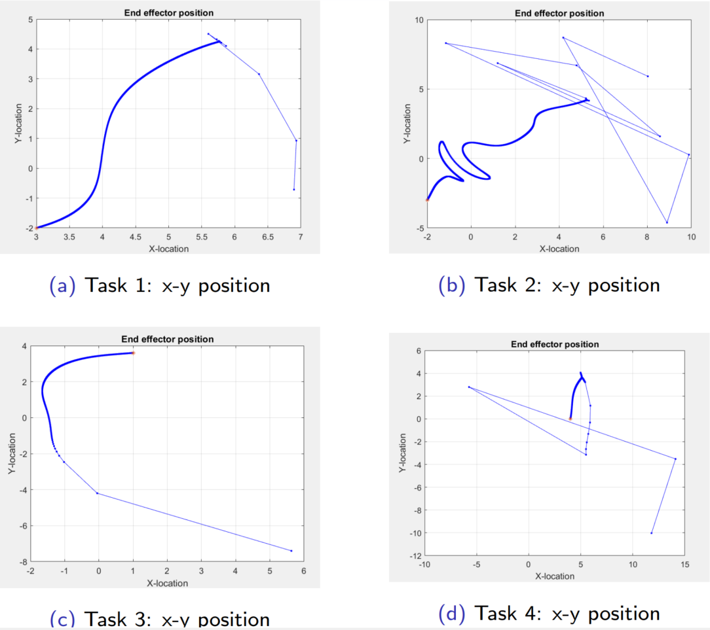
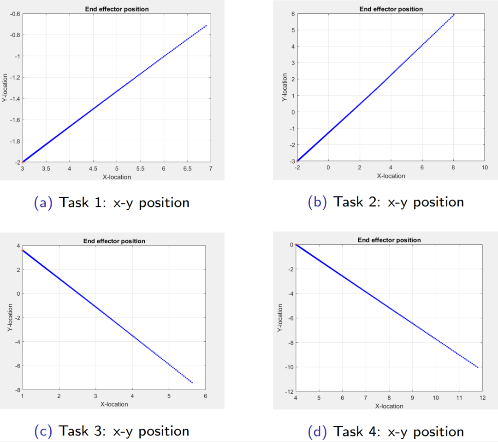

# 🦾 A Comparison of Selected Methods of Inverse Kinematics for Robot Manipulators

This project compares several Inverse Kinematics (IK) algorithms for robot manipulators, focusing on their accuracy, convergence behavior, and computational efficiency.
The methods examined include:
- Jacobian Transpose (JT)
- Jacobian Pseudo-Inverse (JPI)
- Modified Levenberg–Marquardt (MLM)

## 📘 Overview
Inverse kinematics determines the set of joint angles $q$ that achieve a desired end-effector position $x_f$.
This study implements iterative Jacobian-based methods and evaluates their performance under identical simulation tasks.

## 🎯 Objectives
- Implement selected inverse kinematics algorithms for robotic manipulators.
- Evaluate each method based on accuracy, convergence speed, and numerical stability.
- Recommend the most suitable method for real-time trajectory tracking.

## 🧮 Mathematical Formulation
### **Jacobian Transpose Method**
$$
q_{i+1} = q_i + \xi . J^T(q_i) \big(x_f - k(q_i)\big)
$$

---

### **Jacobian Pseudo-Inverse Method**
$$
q_{i+1} = q_i + \xi . J^{\dagger}(q_i) \big(x_f - k(q_i)\big)
$$

where

$$
J^{\dagger}(q_i) = J^T(q_i) . \big(J(q_i) J^T(q_i)\big)^{-1} = J^T(q_i) . (M(q_i))^{-1}
$$

---

### **Modified Levenberg–Marquardt Method**
$$
q_{i+1} = q_i + \xi . J^T(q_i) \big(\text{diag}(M(q_i))^{-1}\big) \big(x_f - k(q_i)\big)
$$

where

$$
M(q_i) = \big(J(q_i) J^T(q_i)\big)^{-1}
$$

---

### **Forward Kinematics**
$$
\mathbf{k}(\mathbf{q}_i) = \begin{bmatrix} x \\ y \end{bmatrix} = \begin{bmatrix} \text{C}_1(\mathbf{q}_i) \\ \text{S}_1(\mathbf{q}_i) \end{bmatrix}
$$

The (m x n) Jacobian matrix is calculated as follows:

$$
J(\mathbf{q}_i) = \frac{\partial \mathbf{k}(\mathbf{q}_i)}{\partial \mathbf{q}_i} =
\begin{bmatrix}
-\text{S}_1(\mathbf{q}_i) & -\text{S}_2(\mathbf{q}_i) & \cdots & -\text{S}_n(\mathbf{q}_i) \\
\text{C}_1(\mathbf{q}_i) & \text{C}_2(\mathbf{q}_i) & \cdots & \text{C}_n(\mathbf{q}_i)
\end{bmatrix}
$$

## ⚙️ Implementation
The algorithms were implemented in **MATLAB**, allowing flexible control over parameters such as:

- Step constant ($\xi$)
- Error tolerance ($\varepsilon$)
- Manipulator link lengths
- Initial joint angles ($q_0$)
- Target position ($x_f$)

The iterative update continues until the end-effector reaches the desired position within a specified error threshold:

$$
\|x_f - k(q_i)\| \leq \varepsilon
$$

Where:

- $x_f$ — target position of the end-effector  
- $k(q_i)$ — current position obtained from forward kinematics  
- $\varepsilon$ — acceptable convergence tolerance  

Each method updates the joint configuration $q_i$ iteratively using its respective rule until the stopping criterion is satisfied.

## 🧪 Simulation Setup
The study evaluates the performance of three inverse kinematic solvers on manipulators with varying degrees of freedom (DOF).  
Each task defines a unique combination of **initial joint angles**, **link lengths**, and **target positions**.

| Task | DOF | Goal Position $(x_f)$ | Initial Angles $(q_0)$ | Link Lengths |
|------|-----|------------------------|--------------------------|--------------|
| 1 | 2 | (3, -2) | (15°, -45°) | 4, 3.5 |
| 2 | 3 | (-2, -3) | (30°, -10°, 45°) | 4, 3.5, 3 |
| 3 | 4 | (1, 3.6) | (0°, -50°, -10°, -75°) | 4, 3.5, 3, 3 |
| 4 | 5 | (4, 0) | (-60°, 30°, 0°, 19°, -55°) | 4, 3.5, 3, 3, 3 |

### **Iteration Stopping Rule**
The algorithm halts when the Euclidean norm of the positional error becomes smaller than the predefined threshold:

$$
\|x_f - k(q_i)\| < \varepsilon
$$

This ensures both accuracy and stability in the inverse kinematic solution, minimizing oscillations and divergence.

### **Simulation Flow**
1. Initialize joint angles ($q_0$) and parameters.  
2. Select the inverse kinematics method (JT, JPI, or MLM).  
3. Compute forward kinematics $k(q_i)$.  
4. Evaluate positional error $(x_f - k(q_i))$.  
5. Update joint angles according to the chosen algorithm.  
6. Repeat until the convergence criterion is met.  

### **Visualization**

Results were visualized using MATLAB’s plotting functions to display:
- End-effector trajectory  
- Convergence progress  
- Final manipulator configuration  

### Simulation Results
### Jacobian Transpose Method - 2, 3, 4 and 5 DOF results

#### Modified Levernberg-Marquardt Method - 2, 3, 4 and 5 DOF results

#### Jacobian Pseudo-Inverse Method - 2, 3, 4 and 5 DOF results

## 📊 Performance Summary and Observations
### **Evaluation Criteria**
The algorithms were compared using:
- **Computation Time ($t_c$)** — total runtime required for convergence.  
- **Number of Iterations ($N_i$)** — how many steps were needed to reach the goal.  
- **End-Effector Error ($E$)** — the final Euclidean distance between the target and computed end-effector position.  

Mathematically:

$$
E = \|x_f - k(q_f)\|
$$

where  
$x_f$ = desired end-effector position,  
$k(q_f)$ = forward kinematics output using final joint angles $q_f$.

### **Comparative Results**
| Method | Avg. Iterations | Avg. Time (s) | Avg. Error ($E$) | Convergence Stability |
|---------|----------------:|---------------:|------------------:|------------------------|
| Jacobian Transpose (JT) | High | Low | Moderate | Sensitive to step size ($\xi$) |
| Jacobian Pseudo-Inverse (JPI) | Moderate | Moderate | Low | Generally stable |
| Modified Levenberg-Marquardt (MLM) | Low | High | Lowest | Highly stable |

### **Observations**
- 🧩 **Jacobian Transpose (JT)**  
  - Simple and computationally light.  
  - Requires careful tuning of the step constant ($\xi$).  
  - Can oscillate or diverge near singularities.  

- ⚙️ **Jacobian Pseudo-Inverse (JPI)**  
  - Offers a good balance between accuracy and speed.  
  - Handles redundant manipulators effectively.  
  - May struggle with ill-conditioned Jacobians.  

- 🚀 **Modified Levenberg-Marquardt (MLM)**  
  - Provides the most accurate convergence among all methods.  
  - Exhibits smooth and stable behavior near singularities.  
  - Slightly higher computational cost due to damping term optimization.

### **Overall Conclusion**
The **Modified Levenberg-Marquardt (MLM)** algorithm demonstrated the **best overall performance** in terms of:
- Fast convergence  
- Low steady-state error  
- High stability in complex joint configurations  

However, for **real-time applications**, the **Jacobian Pseudo-Inverse** remains a practical trade-off between **speed** and **accuracy**, while the **Jacobian Transpose** is most suited for lightweight or low-power robotic systems.

